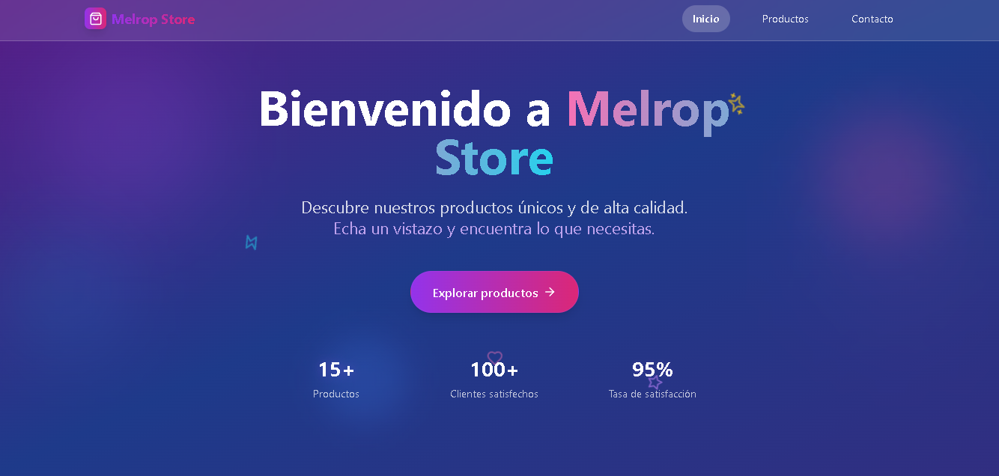
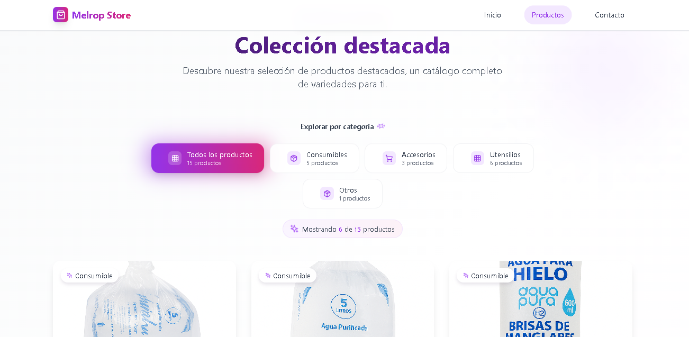
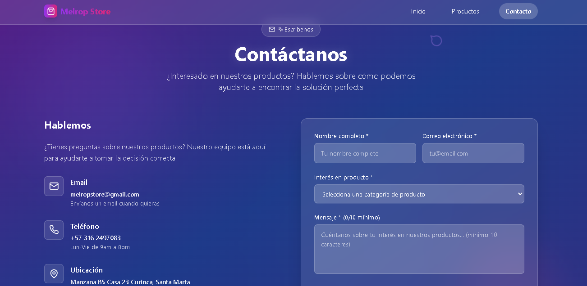

# Melrop Store 🛒

Una tienda en línea informativa para clientes interesados en compra de variedades de productos, entre ellos, consumibles, utensilios y otros más.

## Demostración

A continuación se muestran imagenes de la web app en funcionamiento:

<p align="center">
  
</p>
<p align="center">
  
</p>
<p align="center">
  
</p>

## Tecnologías usadas para la web app

- React 18
- TypeScript
- Tailwind CSS
- Framer Motion
- EmailJS
- Vite

## Features implementados

- Diseño responsive y moderno.
- Animaciones fluidas con Framer Motion.
- Catálogo de productos con filtros.
- Formulario de contacto funcional.

## Instalación y desarrollo

```bash
# Instalar dependencias
npm install

# Ejecutar en desarrollo
npm run dev

# Construir para producción
npm run build
```

Este proyecto esta bajo la licencia Creative Commons (CC).

© 2025